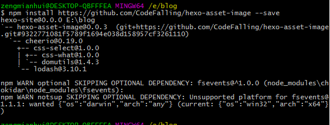

## 文章来自
[在 hexo 中无痛使用本地图片](http://www.tuicool.com/articles/umEBVfI)
# hexo个人博客-如何在markdown上引用本地图片的地址？
## 相关的问题
由于markdown的相关特性，图片只能来自于网络，但是使用markdown写博客之前，就得先将图片上传到网络，非常地不方便，所以我采用插件的方式来消除这种麻烦，代码还是markdown语法，虽然编辑markdown的时候，看不到图片，但是上发布到github上时，就是正常的
## 插件地址
<!--more-->
[hexo-asset-image](https://github.com/CodeFalling/hexo-asset-image)
## 解决方案
### _config.yml
> 在配置文件中_config.yml 查看是否存在 post_asset_folder:true 。
### 安装插件
> npm install https://github.com/CodeFalling/hexo-asset-image --save




### 创建目录
```
hexo个人博客-如何在markdown上引用本地图片的地址？
└── 1.png
hexo个人博客-如何在markdown上引用本地图片的地址？.md

```
在博客的同级目录下创建一个与markdown文件名一样的文件夹
### 在markdown使用正常语法
然后使用正常的语法
```

```
然后会生成相应public结构

```
public/2017/03/01/hexo个人博客-如何在markdown上引用本地图片的地址？
└── 1.png
```
同时生成的html是

```

```


