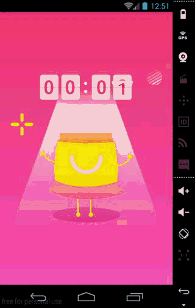

# viewpager在最后一页滑动之后，跳转到主页面

## 思路

主要有是两个监听，
一是addOnPageChangeListener();二是setOnTouchListener()；

addOnPageChangeListener()主要是为了获取position(滑动到了第几页)

setOnTouchListener()主要是判断在最后一页中是否向左滑动了，然后进入主页

<!-- more -->

## 主要功能代码
### addOnPageChangeListener();

```
viewPager.addOnPageChangeListener(new ViewPager.OnPageChangeListener() {
            @Override
            public void onPageScrolled(int position, float positionOffset, int positionOffsetPixels) {

            }

            @Override
            public void onPageSelected(int position) {
                currentItem = position;//获取位置，即第几页
                Log.i("Guide","监听改变"+position);
            }

            @Override
            public void onPageScrollStateChanged(int state) {

            }
        });
```
### setOnTouchListener()；

```
viewPager.setOnTouchListener(new View.OnTouchListener() {
            float startX;
            float startY;//没有用到
            float endX;
            float endY;//没有用到
            @Override
            public boolean onTouch(View v, MotionEvent event) {
                switch (event.getAction()){
                    case MotionEvent.ACTION_DOWN:
                        startX=event.getX();
                        startY=event.getY();
                        break;
                    case MotionEvent.ACTION_UP:
                        endX=event.getX();
                        endY=event.getY();
                     WindowManager windowManager= (WindowManager)                                   getApplicationContext().getSystemService(Context.WINDOW_SERVICE);
       
                        //获取屏幕的宽度
                 Point size = new Point();
                 windowManager.getDefaultDisplay().getSize(size);
                        int width=size.x;
                        
 //首先要确定的是，是否到了最后一页，然后判断是否向左滑动，并且滑动距离是否符合，我这里的判断距离是屏幕宽度的4分之一（这里可以适当控制）
if(currentItem==(imageViews.size()-1)&&startX-endX>=(width/4)){
       Log.i(LOG,"进入了触摸");
       goToMainActivity();//进入主页
                            overridePendingTransition(R.anim.slide_in_right,R.anim.slide_in_left);//这部分代码是切换Activity时的动画，看起来就不会很生硬
                        }
                        break;
                }
                return false;
            }
        });
```
## 以下是全部代码
### GuideActivity

```
package com.tc.mobileshop;

import android.content.Context;
import android.content.Intent;
import android.graphics.Point;
import android.support.v4.view.PagerAdapter;
import android.support.v4.view.ViewPager;
import android.support.v7.app.AppCompatActivity;
import android.os.Bundle;
import android.util.Log;
import android.view.Display;
import android.view.MotionEvent;
import android.view.View;
import android.view.ViewGroup;
import android.view.WindowManager;
import android.widget.ImageView;

import com.tc.mobileshop.utils.DisplayUtils;

import java.util.ArrayList;
import java.util.List;

public class GuideActivity extends AppCompatActivity {
    private static final String LOG = "GuideActivity";
    int touchCount;
    int currentItem;
    List<Integer> imageIDList;
    List<ImageView> imageViews;
    ViewPager viewPager;
    @Override
    protected void onCreate(Bundle savedInstanceState) {
        super.onCreate(savedInstanceState);
        setContentView(R.layout.activity_guide);
        //初始化引导数据
        initGuideData();
        //初始化引导页
        initGuideView();
        //初始化分页控件
        iniView();
    }


    /**
     * 初始化引导页数据
     */
    private void initGuideData() {
        imageIDList = new ArrayList();
        imageIDList.add(R.mipmap.apk_img1);
        imageIDList.add(R.mipmap.apk_img2);
        imageIDList.add(R.mipmap.apk_img3);
    }

    /**
     * 初始化引导页
     */
    private void initGuideView() {
        imageViews = new ArrayList<>();
        for (int i = 0; i < imageIDList.size(); i++) {
            imageViews.add(new ImageView(this));
        }
    }

    /**
     * 初始化分页控件
     */
    private void iniView() {
        viewPager = (ViewPager) findViewById(R.id.guide_pager);
        viewPager.setAdapter(new GuideAdapter());
        viewPager.addOnPageChangeListener(new ViewPager.OnPageChangeListener() {
            @Override
            public void onPageScrolled(int position, float positionOffset, int positionOffsetPixels) {

            }

            @Override
            public void onPageSelected(int position) {
                currentItem = position;
                Log.i("Guide","监听改变"+position);
            }

            @Override
            public void onPageScrollStateChanged(int state) {

            }
        });
        viewPager.setOnTouchListener(new View.OnTouchListener() {
            float startX;
            float startY;
            float endX;
            float endY;
            @Override
            public boolean onTouch(View v, MotionEvent event) {
                switch (event.getAction()){
                    case MotionEvent.ACTION_DOWN:
                        startX=event.getX();
                        startY=event.getY();
                        break;
                    case MotionEvent.ACTION_UP:
                        endX=event.getX();
                        endY=event.getY();
                        WindowManager windowManager= (WindowManager) getApplicationContext().getSystemService(Context.WINDOW_SERVICE);
                        //获取屏幕的宽度
                        Point size = new Point();
                        windowManager.getDefaultDisplay().getSize(size);
                        int width=size.x;
                        //首先要确定的是，是否到了最后一页，然后判断是否向左滑动，并且滑动距离是否符合，我这里的判断距离是屏幕宽度的4分之一（这里可以适当控制）
                        if(currentItem==(imageViews.size()-1)&&startX-endX>0&&startX-endX>=(width/4)){
                            Log.i(LOG,"进入了触摸");
                            goToMainActivity();
                            overridePendingTransition(R.anim.slide_in_right,R.anim.slide_in_left);
                        }
                        break;
                }
                return false;
            }
        });
    }

    private void goToMainActivity() {
        Intent intent=new Intent(this,MainActivity.class);
        startActivity(intent);
        finish();
    }

    /**
     * Viewpager适配器
     */
    private class GuideAdapter extends PagerAdapter {

        @Override
        public int getCount() {
            return imageViews.size();
        }

        /**
         * 判断当前分页是不是view
         * 由于ViewPager里面的分页可以填入Fragment
         *
         * @param view
         * @param object
         * @return
         */
        @Override
        public boolean isViewFromObject(View view, Object object) {
            return view == object;
        }

        /**
         * 清理内存
         * 从第一页滑动到第二页，此时第一页的内存应该释放
         *
         * @param container
         * @param position
         * @param object
         */
        @Override
        public void destroyItem(ViewGroup container, int position, Object object) {
           container.removeView(imageViews.get(position));//释放滑动过后的前一页
        }

        /**
         * 得到---->暂时是没有用的
         *
         * @param object
         * @return
         */
        @Override
        public int getItemPosition(Object object) {
            return super.getItemPosition(object);
        }

        /**
         * 初始化分页
         *
         * @param container
         * @param position
         * @return
         */
        @Override
        public Object instantiateItem(ViewGroup container, int position) {
            ImageView imageView = imageViews.get(position);
            imageView.setImageResource(imageIDList.get(position));
            ViewGroup.LayoutParams viewLayoutParams = new ViewGroup.LayoutParams
                    (
                            DisplayUtils.dip2px(GuideActivity.this, 170),
                            DisplayUtils.dip2px(GuideActivity.this, 200)
                    );
            container.addView(imageView,viewLayoutParams);//设置图片的宽高

            return imageView;
        }
    }
}

```
### 以下为动画资源代码
#### slide_in_left.xml

```
<?xml version="1.0" encoding="utf-8"?>
<set xmlns:android="http://schemas.android.com/apk/res/android">
    <translate
        android:duration="1000"
        android:fromXDelta="0%p"
        android:toXDelta="-100%"
        />

</set>
```
####slide_in_right.xml

```
<?xml version="1.0" encoding="utf-8"?>
<set xmlns:android="http://schemas.android.com/apk/res/android">
    <translate
        android:duration="1000"
        android:fromXDelta="100%p"
        android:toXDelta="0"
        />

</set>
```
#### 以下是动画效果
