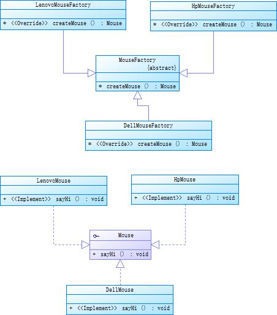

# 参考链接（如有侵权立即删除） 
[Abstract Factory——java-design-patterns](http://java-design-patterns.com/patterns/abstract-factory/)  
[简单工厂、工厂方法和抽象工厂模式示例——CSDN@逐兔郎](https://blog.csdn.net/zhutulang/article/details/43495825)  
[简单工厂模式,工厂方法模式和抽象工厂模式的异同——百度词库@hui332986207](https://wenku.baidu.com/view/60c6ca21192e45361066f5e0.html)  
[抽象工厂模式和工厂模式的区别？——知乎](https://www.zhihu.com/question/20367734/answer/115807228)  
[开闭原则——百度百科](https://baike.baidu.com/item/%E5%BC%80%E9%97%AD%E5%8E%9F%E5%88%99/2828775)
## 推荐学习地址
[java-design-patterns](http://java-design-patterns.com)  
# 正文
## 概述
&emsp;&emsp;首先我们需要了解一下“开闭原则”，“开闭原则”就是不修改原有的代码，通过增加模块的方式来扩展原有的功能。接下来简述三种设计模式

<!-- more -->

1. 简单工厂模式

> &emsp;&emsp;专门定义一个类来负责创建其他类的实例，被创建的实例通常都具有+共同的父类。它又称为静态工厂方法模式。它的实质是由一个工厂类根据传入的参数，动态决定应该创建哪一个产品类（这些产品类继承自一个父类或接口）的实例。简单工厂模式的创建目标，所有创建的对象都是充当这个角色的某个具体类的实例。

2. 工厂方法模式（工厂模式）

> &emsp;&emsp;工厂方法是粒度很小的设计模式，因为模式的表现只是一个抽象的方法。+提前定义用于创建对象的接口，让子类决定实例化具体的某一个类，即在工厂和产品中间增加接口，工厂不再负责产品的创建，由接口针对不同条件返回具体的类实例，由具体类实例去实现。

3. 抽象工厂模式

> &emsp;&emsp;抽象工厂模式是提供一个接口来创建相关或依赖对象的类，而不指定它们的具体类。抽象工厂与工厂模式很像，只是抽象工厂更像是工厂中工厂，既然叫抽象工厂，当然是工厂具体用途是什么时候我们不确定了，但是我们设计工厂的原型，规范了未来工厂的扩展。
 
### 简单工厂模式


假设需要生产两种鼠标，戴尔鼠标和惠普鼠标。
```
/**
 * 创建一个鼠标工厂，用来生产鼠标
 * @author zmh
 *
 */
public class MouseFactory {
    private MouseFactory() {
    }
    /**
     * 生产鼠标,0为戴尔，1为惠普
     */
    public static Mouse createMouse(int i){
        return i==0?(new DellMouse()):(new HpMouse());
    }
}
/**
 * 设计鼠标接口
 * @author zmh
 *
 */
public interface Mouse {
    void sayHi();
}
/**
 * 戴尔鼠标
 * @author zmh
 *
 */
public class DellMouse implements Mouse{

    @Override
    public void sayHi() {
        System.out.println("戴尔鼠标");
    }
    
}
/**
 * 惠普鼠标
 * @author zmh
 *
 */
public class HpMouse implements Mouse{

    @Override
    public void sayHi() {
        System.out.println("惠普鼠标");     
    }

}
/**
 * 简单工厂模式
 * 简单工厂模式不是23种设计模式中的，专门定义一个用来创建其他类，这些类通常都拥有同一个父类。
 * @author zmh
 *
 */
public class Main {
    public static void main(String[] args) {
        Mouse mouse = MouseFactory.createMouse(0);//创建鼠标工厂
        mouse.sayHi();
    }
}
```
## 工厂方法模式
假设现在不仅有戴尔鼠标和惠普鼠标了，而且还要生产联想鼠标，但是我们原告的简单工厂设计模式，已经定义好`MouseFacotry`仅生产两种鼠标，如果要去修改源代码的话，违背了“开闭原则”，所以简单工厂设计模式不适用产品扩展。现在我们来使用工厂方法模式扩展鼠标产品的生产。  

```
/**
 * 戴尔鼠标
 * @author zmh
 *
 */
public class DellMouse implements Mouse{

    @Override
    public void sayHi() {
        System.out.println("戴尔鼠标"+test());
    }
}

public class DellMouseFactory extends MouseFactory {

    @Override
    Mouse createMouse() {
        return new DellMouse();
    }

}
/**
 * 惠普鼠标
 * @author zmh
 *
 */
public class HpMouse implements Mouse{

    @Override
    public void sayHi() {
        System.out.println("惠普鼠标");     
    }

}

public class HpMouseFactory extends MouseFactory{

    @Override
    Mouse createMouse() {
        return new HpMouse();
    }


}
/**
 * 联想鼠标
 * @author zmh
 *
 */
public class LenovoMouse implements Mouse{

    @Override
    public void sayHi() {
        System.out.println("联想鼠标");
    }

}

public class LenovoMouseFactory extends MouseFactory {

    @Override
    Mouse createMouse() {
        return new LenovoMouse();
    }

}
/**
 * 鼠标
 * @author zmh
 *
 */
public interface Mouse {
    void sayHi();

    default double test(){
        return 1L;
    }
}
/**
 * 设计鼠标工厂
 * @author zmh
 *
 */
public abstract class MouseFactory {
    abstract Mouse createMouse();
}


/**
 * 工厂方法模式
 * @author zmh
 *
 */
public class Main {
    public static void main(String[] args) {
        //如果未来有更多类型的鼠标，那么我们就实现更多工厂
        Mouse dellMouse = new DellMouseFactory().createMouse();
        dellMouse.sayHi();
        Mouse hpMouse = new HpMouseFactory().createMouse();
        hpMouse.sayHi();
        Mouse lenovoMouse = new LenovoMouseFactory().createMouse();
        lenovoMouse.sayHi();

    }
}
```

## 抽象工厂
如果现在我们不仅有鼠标产品，还有键盘或者耳机等等，其他产品，这样也不能在工厂方法模式上去修改源代码了，因为工厂方法模式只下定义了子类只能生产鼠标，而不能生产其他产品。

```
/**
 * 抽象设计鼠标，规范未来产品
 * @author zmh
 *
 */
public interface Mouse {
    void sayHi();
}
/**
 * 抽象设计键盘，规范未来产品
 * @author zmh
 *
 */
public interface KeyBo {
    void sayHi();
}
/**
 * 华硕鼠标
 * @author zmh
 *
 */
public class AsusMouse implements Mouse {

    @Override
    public void sayHi() {
        System.out.println("华硕鼠标");
    }

}
/**
 * 华硕键盘
 * @author zmh
 *
 */
public class AsusKeyBo implements KeyBo {

    @Override
    public void sayHi() {
        System.out.println("华硕键盘");
    }

}
/**
 * 戴尔鼠标
 * @author zmh
 *
 */
public class DellMouse implements Mouse{

    @Override
    public void sayHi() {
        System.out.println("戴尔鼠标");
    }
}
/**
 * 戴尔键盘
 * @author zmh
 *
 */
public class DellKeyBo implements KeyBo {

    @Override
    public void sayHi() {
        System.out.println("戴尔键盘");
    }

}
/**
 * 惠普鼠标
 * @author zmh
 *
 */
public class HpMouse implements Mouse{

    @Override
    public void sayHi() {
        System.out.println("惠普鼠标");     
    }

}
/**
 * 惠普键盘
 * @author zmh
 *
 */
public class HpKeyBo implements KeyBo {

    @Override
    public void sayHi() {
        System.out.println("惠普键盘");
    }

}
/**
 * 如果需要增加新产品时，简单工厂和工厂方法都违背了开闭原则，我们现在使用抽象工厂模式
 * 抽象化工厂，使用工厂可以被扩展，可以有键盘工厂，耳机工厂，甚至戴尔键盘工厂，戴尔耳机工厂
 * @author zmh
 *
 */
public abstract class PcFatory {
    abstract Mouse createMouse();
    abstract KeyBo createKeyBo();
}
/**
 * 华硕工厂，可以生产鼠标和键盘
 * @author zmh
 *
 */
public class AsusFactory extends PcFatory {

    @Override
    Mouse createMouse() {
        return new AsusMouse();
    }

    @Override
    KeyBo createKeyBo() {
        // TODO Auto-generated method stub
        return new AsusKeyBo();
    }

}
/**
 * 戴尔工厂
 * @author zmh
 *
 */
public class DellFactory extends HpFactory {

    @Override
    Mouse createMouse() {
        return new DellMouse();
    }

    @Override
    KeyBo createKeyBo() {
        return new DellKeyBo();
    }

}
/**
 * 惠普工厂，现在工厂不仅可以生产鼠标了，还可以生产键盘
 * @author zmh
 *
 */
public  class HpFactory extends PcFatory{
     Mouse createMouse() {
        return new HpMouse();
    }

    @Override
    KeyBo createKeyBo() {
        return new HpKeyBo();
    }
}

public static void main(String[] args) {
//每个工厂可以生产两种产品
        PcFatory hpf=new HpFactory();
        Mouse hpm = hpf.createMouse();
        hpm.sayHi();
        KeyBo hpk = hpf.createKeyBo();
        hpk.sayHi();
        
        PcFatory asf=new AsusFactory(); 
        Mouse asm = asf.createMouse();
        asm.sayHi();
        KeyBo ask = asf.createKeyBo();
        ask.sayHi();
        
        PcFatory def=new DellFactory(); 
        Mouse dem = def.createMouse();
        dem.sayHi();
        KeyBo dek = def.createKeyBo();
        dek.sayHi();

    }

```

### 我们也可以使用枚举的方法创建工厂，减少大部分的代码
```
/**
 * 使用枚举方式，创建工厂
 * @author zmh
 *
 */
public class FactoryMarker {
    public enum FactoryType{
        ASUS,DELL,HP
    }
    public static PcFatory getFactory(FactoryType type){
        switch (type) {
        case ASUS:
            return new AsusFactory();
        case DELL:
            return new DellFactory();
        case HP:
            return new HpFactory();

        default:
            throw new IllegalArgumentException("KingdomType not supported.");
        }
    }
    public static void main(String[] args) {
        /**
         * 我们还可以为工厂类实现枚举，省去大部分的代码
         */
        PcFatory asusFatory = FactoryMarker.getFactory(FactoryType.ASUS);
        Mouse asusMouse = asusFatory.createMouse();
        System.out.println("--------------------");
        asusMouse.sayHi();
    }
}

```


